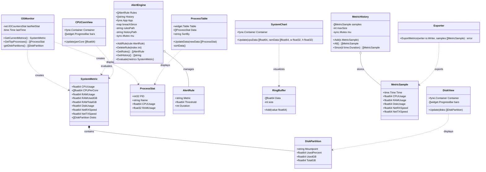

# SysMON — System Resource Monitor (MVP) · Tugas PBO

Aplikasi **desktop** pemantau sumber daya sistem secara *real-time*: **CPU (total + per-core), RAM, Disk (per-partisi), dan Jaringan (RX/TX)**. Dibangun dengan arsitektur berlapis (*Layered Architecture*) untuk memenuhi syarat mata kuliah Pemrograman Berorientasi Objek (Studi Kasus 5).

## 🛠️ Stack Teknologi
* **Bahasa:** Go (Golang) — *statically-typed & compiled*
* **GUI Framework:** Fyne v2 (cross-platform, punya canvas untuk chart kustom)
* **OS Metrics:** gopsutil v3 (`cpu`, `mem`, `disk`, `net`, `process`)

## 🖥️ Target OS
Dikembangkan & diuji di **Windows 11**. Karena library `gopsutil` & `Fyne` cross-platform, kode juga dapat dikompilasi di Linux/macOS, namun verifikasi resmi hanya pada Windows (sesuai catatan spesifikasi: single-OS diperbolehkan).

## ✨ Fitur (MVP)
* **Monitoring real-time** (sampling tiap ~1–2 detik):
  * CPU: persentase total **+ beban tiap logical core** (progress bar per-core)
  * RAM: terpakai (GB) / total / persentase
  * Disk: penggunaan **tiap partisi** (terpakai / total / persentase)
  * Network: throughput download (RX) & upload (TX) dalam KB/s
* **Live chart** garis CPU & RAM (60 detik terakhir, ring buffer, update halus).
* **Process list:** PID, nama, CPU%, RAM% — dapat di-*sort* (CPU/RAM) & refresh tiap 3 detik.
* **Alert system:**
  * Buat aturan dari UI (metrik, threshold %, durasi detik) → contoh: *"CPU > 90% selama 30 detik"*.
  * Aturan **tersimpan** di `alerts.json` dan tetap aktif setelah aplikasi di-restart.
  * Notifikasi sistem saat aturan terpenuhi.
  * **Riwayat alert persisten** di `alert_history.json` (tetap ada setelah restart).
  * Hapus aturan dari UI.
* **Export** riwayat metrik (CPU, RAM, Disk, Network) ke **CSV** dengan **pilihan rentang waktu** (1/5/15 menit atau semua).

> Scope sengaja dibatasi pada fitur **MVP** sesuai spesifikasi; stretch goals belum dikerjakan.

## 🏗️ Arsitektur (OOP & Layered)
```
cmd/main.go                 → komposisi UI & wiring (presentation entrypoint)
internal/
 ├─ models/                 → struktur data inti (tanpa dependensi eksternal)
 │   ├─ metric.go           → SystemMetric, DiskPartition, ProcessStat
 │   ├─ alert.go            → AlertRule
 │   ├─ ring_buffer.go      → RingBuffer (60 sampel terakhir untuk chart)
 │   └─ history.go          → MetricSample, MetricHistory (riwayat untuk export)
 ├─ repository/             → abstraksi akses OS yang "kotor"
 │   └─ os_monitor.go       → OSMonitor (gopsutil → SystemMetric/ProcessStat)
 ├─ services/               → business logic murni
 │   ├─ alert_engine.go     → AlertEngine (evaluasi rule, persistensi, notifikasi)
 │   └─ exporter.go         → Exporter (metric → CSV)
 └─ ui/                     → komponen presentasi Fyne kustom
     ├─ chart.go            → SystemChart (line chart)
     ├─ process_table.go    → ProcessTable
     ├─ core_view.go        → CPUCoreView (bar per-core)
     └─ disk_view.go        → DiskView (bar per-partisi)
```
Penerapan prinsip OOP:
* **Encapsulation:** field privat (`size`, `breachSince`, `historyPath`, `lastNetStat`, `mu`) hanya diakses lewat method; akses concurrent dilindungi `sync.Mutex`.
* **Abstraction:** `OSMonitor` menyembunyikan detail gopsutil; UI hanya tahu `SystemMetric`.
* **Separation of concerns:** model ⇄ repository ⇄ service ⇄ UI tidak saling bocor.

## 🚀 Setup & Menjalankan

### Prasyarat
1. **Go** 1.21+ — <https://go.dev/dl/>
2. **C compiler** (Fyne butuh CGO untuk render GUI):
   * Windows: MinGW-w64 (mis. via [MSYS2](https://www.msys2.org/)) — pastikan `gcc` ada di `PATH`.
   * Linux: `sudo apt install build-essential libgl1-mesa-dev xorg-dev`
   * macOS: Xcode Command Line Tools (`xcode-select --install`).

### Langkah
```bash
# 1. Clone repositori
git clone <url-repo>
cd SysMON

# 2. Unduh dependensi
go mod tidy

# 3. Jalankan langsung
go run ./cmd

# (opsional) build menjadi executable
go build -o sysmon ./cmd
./sysmon          # Windows: sysmon.exe
```

## 📁 Persistensi
File berikut dibuat otomatis di direktori kerja dan dimuat kembali saat aplikasi dijalankan lagi:
* `alerts.json` — aturan alert (disimpan saat tambah/hapus aturan).
* `alert_history.json` — riwayat alert yang pernah ter-trigger.

## 📊 Class Diagram (Mermaid)


## 🧪 Manual Testing Checklist
OS uji: **Windows 11**. Cara menjalankan: `go run ./cmd`.
Tandai `[x]` bila lolos. Untuk verifikasi akurasi, buka **Task Manager** berdampingan.

### 1. Startup
- [ ] Aplikasi terbuka tanpa crash (jendela "SysMON - System Resource Monitor" muncul).
- [ ] Tiga tab tersedia: **Dashboard**, **Processes**, **Alerts**.

### 2. Monitoring Real-Time (tab Dashboard)
- [ ] Kartu **CPU** menampilkan persentase dan berubah tiap ~1–2 detik.
- [ ] Nilai CPU total sesuai Task Manager (toleransi ±5%).
- [ ] Bagian **CPU Per-Core** menampilkan progress bar untuk SETIAP logical core.
- [ ] Beri beban CPU (mis. buka banyak tab / proses berat) → bar per-core ikut naik.
- [ ] Kartu **RAM** menampilkan format `X.X GB (Y.Y%)` dan sesuai Task Manager.
- [ ] Kartu **Net (KB/s)** menampilkan `↓` (RX) dan `↑` (TX); unduh file → angka ↓ naik.
- [ ] Kartu **Disk (Primary)** menampilkan persentase partisi utama.

### 3. Disk Partitions (tab Dashboard)
- [ ] Bagian **Disk Partitions** menampilkan SEMUA drive (mis. C:, D:).
- [ ] Tiap partisi menunjukkan `terpakai GB / total GB` + progress bar.
- [ ] Drive optik kosong / tidak terbaca tidak membuat aplikasi error (cukup tidak tampil).

### 4. Live Chart (tab Dashboard)
- [ ] Grafik garis menampilkan dua garis: CPU (merah) & RAM (biru) sesuai legenda.
- [ ] Garis bergerak halus ke kiri, menampilkan ~60 detik terakhir, tanpa flicker berat.
- [ ] Sumbu Y menampilkan grid 0–100%.

### 5. Process List (tab Processes)
- [ ] Tabel menampilkan kolom PID, PROCESS NAME, CPU %, RAM %.
- [ ] Daftar refresh berkala (≥ 2 detik).
- [ ] Ganti **Sort By → RAM**: urutan langsung berubah & panah `↓` pindah ke kolom RAM.
- [ ] Ganti **Sort By → CPU**: urutan kembali berdasarkan CPU.

### 6. Alert System (tab Alerts)
- [ ] Form "Buat Aturan Alert" punya: pilihan Metrik (CPU/RAM), Threshold (%), Durasi (detik).
- [ ] Input threshold kosong / > 100 / bukan angka → muncul dialog error validasi.
- [ ] Input durasi bukan angka → muncul dialog error validasi.
- [ ] Tambah aturan valid (mis. CPU > 50% selama 5 detik) → muncul "Sukses" & aturan tampil di "Aturan Aktif".
- [ ] File `alerts.json` ter-update berisi aturan baru.
- [ ] Picu kondisi (beban CPU di atas threshold selama durasi) → muncul **notifikasi sistem** & baris baru di "Log Peringatan".
- [ ] Durasi benar-benar dihitung dalam DETIK (alert tidak trigger sebelum durasi tercapai).
- [ ] Klik tombol hapus (ikon merah) pada aturan → aturan hilang & `alerts.json` ter-update.

### 7. Persistensi (restart)
- [ ] Tambah 1 aturan, tutup aplikasi, jalankan lagi → aturan masih ada di "Aturan Aktif".
- [ ] File `alerts.json` berisi aturan yang ditambahkan.
- [ ] Setelah ada alert ter-trigger lalu aplikasi di-restart → **Log Peringatan tetap menampilkan riwayat lama** (dimuat dari `alert_history.json`).

### 8. Export CSV (tab Dashboard)
- [ ] Bagian **Export Data** punya dropdown **Range Waktu** (1 Menit / 5 Menit / 15 Menit / Semua) & tombol **Export ke CSV**.
- [ ] Pilih **Semua** → klik Export → dialog simpan muncul dengan nama default `metric_history.csv`.
- [ ] Simpan → muncul "Sukses (N sampel ...)"; file CSV punya kolom `Timestamp, CPU, RAM, Disk, Net RX, Net TX` dan dapat dibuka di Excel/Notepad.
- [ ] Pilih **1 Menit** → jumlah baris yang diexport lebih sedikit daripada **Semua** (hanya data ~1 menit terakhir).
- [ ] Export tepat setelah aplikasi dibuka (data masih kosong/kurang) → muncul info "Belum ada data pada rentang tersebut" (tidak crash).

### 9. Stabilitas
- [ ] Biarkan aplikasi berjalan ≥ 30 menit → tidak crash, tidak freeze.
- [ ] SysMON sendiri tidak menjadi top consumer di daftar proses.
